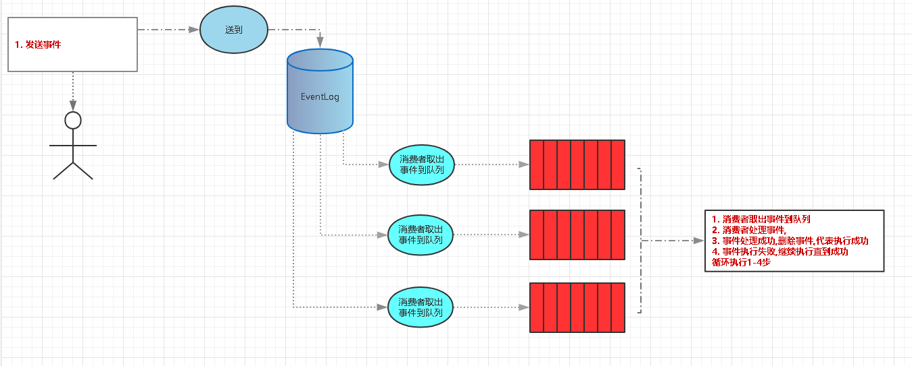

# Event Worker

> 业务频繁的变动，频繁增减活动，导致开发修改现有的业务逻辑，造成程序很混乱，质量无法保证。
也导致测试进行了大量重复而不必要测测试,从而浪费大量的人力成本,而不能有预期到结果。

### 注意
> Event Worker 当前版本只针对中小型企业，因为部署简单，你可以快速的安装使用。
> 之后会有 Event Worker RabbitMQ 就是针对大型企业，高并发业务场景。

## 使用场景 
> 1. 主要务不变，一些像活动、注册、登录、购买送积分、发短信等
> 2. saas平台使用为每个客户部署环境，很多公司用docker 快速部署环境，环境创建后会导入sql，但是可能创建成功事件不确定，我们可以发送一个import_event
事件来解决这个问题

### 案例:

##### 1. 用户注册
> 这个月是送积分，可能下个月送红包

##### 2. 比如活动，每次节假日的活动规则不一样
> 1. 3.8妇女节,女性用户登录（可以获得专属优惠券，购买商品后可以获得额外返现或者双倍积分等规则）
> 2. 5.1劳动节邀请好友(获得实物大礼包,好友购买商品,送2元红包,1.5倍积分，邀请人获得3元红包，10个积分)，购买商品送劳动币。
> 3. 国庆节活动登录、注册、购买商品送爱国币。

### 问题：
> 1. 登录送积分、送红包
> 2. “5.1”劳动节购买商品送劳动币等
> 3. 国庆登录、注册、购买送爱国比

> 在上面这个场景,其实登录、购买、邀请好友这些逻辑是没有变化，每次活动或者需求程序员根据需求不停的修改业务逻辑，每次更改业务，测试都要去做一些重复的测试，那么有没有办法简单化呢。

### 解决：
> 我们使用事件（Event），在注册、登录、购买、邀请好友我们都发送相应的事件（注册register_event、登录login_event、购买product_buy_event、邀请好友inviting_friend_event），我们可以监听在不同的消费者监听同一事件，例如我们登录要送积分，国庆登录又要送爱国比，那么登录登录(login_event)事件同时要送积分和爱国比，我们可以分别写2个消费者去监听登录事件，一个登录送积分消费者，一个国庆消费者送爱国比，当国庆结束我们可以停止国庆消费者。而不必关登录送积分消费者





## Event Worker使用demo[Event-Worker-Simple](https://github.com/qq1060656096/event-worker-simple/tree/develop)


## 使用示例(use)
> 1. 我们在"D:\phpStudy\WWW\php7"文件夹下中创建"event-demo"文件夹作为我们我项目目录
> 2. 现在我们已经创建好了"D:\phpStudy\WWW\php7\event-demo"文件夹
> 3. 创建数据库连接配置文件"config/bao-loan.yml"并加入以下内容

```yml
# 数据库配置
DB_HOST: "localhost" # 主机
DB_PORT: 3306 # 端口
DB_USER: "root" # 用户名
DB_PASS: "root" # 密码
DB_NAME: "demo" # 数据库名
DB_TABLE_PREFIX: "" # 表前缀
DB_CHARSET: "utf8" # 设置字符编码,空字符串不设置
DB_SQLLOG: false # 是否启用sql调试
```

> 4. 创建event-workp配置文件"config/event-worker.conf.yml"并加入以下内容
```yml
# 事件列表
events:
  BUY_PRODUCT: 1 # 用户购买产品

# 模块列表
modules:
  user_buy_module: # docker 模块
    class: "\\Zwei\\EventWork\\Tests\\Demo\\DockerModule" # 调用类
    callback_func: "run" # 调用方法
    listen_events: # 监听事件列表
      - BUY_PRODUCT
```

> 5. 在项目目录下创建"composer.json"文件并加入以下内容
```json
{
	"repositories": [
        {
            "type": "vcs",
            "url": "https://github.com/qq1060656096/event-worker.git"
        }
    ],
	"require": {
		"zwei/event-work": "dev-1.1.dev"
	}
}
```

> 6. 执行"composer install"安装

> 7. 创建"EventWorkerRun.php"并加入以下内容
```php
<?php

switch (true) {
    // 参数错误
    case empty($argv[1]):
        throw new \Exception('The module name cannot be empty.');
        break;
    // 请传入引入composer autoload.php
    case empty($argv[2]):
        $composerAutoload = \Zwei\ComposerVendorDirectory\ComposerVendor::getDir().'/autoload.php';
        if (!file_exists($composerAutoload)) {
            $errorMsg = sprintf("the boot file is found.(boot-file: %s)", $composerAutoload);
            throw new Exception($errorMsg);
        }
        break;
    default:
        list($moduleName, $composerAutoload) = [$argv[1], $argv[2]];
        break;
}
require $composerAutoload;
\Zwei\EventWork\EventWorker::run($moduleName);
```

> 8. 创建"sendEvent.php"并加入以下内容
```php
<?php
$sendData = [
    'productId' => 1,// 购买产品id
    'quantity' => 10,// 购买数量
    'couponId' => 0,// 优惠券id
    'uid' => 10,//购买用户
]; 
// 用户购买产品
\Zwei\EventWork\EventSend::send('BUY_PRODUCT', $data);
```

# 单元测试使用

> --bootstrap 在测试前先运行一个 "bootstrap" PHP 文件
- --bootstrap引导测试: phpunit --bootstrap vendor/autoload.php tests/
- --bootstrap引导测试: phpunit --bootstrap tests/TestInit.php tests/

D:\phpStudy\php\php-7.0.12-nts\php.exe vendor\phpunit\phpunit\phpunit --bootstrap tests/TestInit.php tests/EventTest.php
D:\phpStudy\php\php-7.0.12-nts\php.exe vendor\phpunit\phpunit\phpunit --bootstrap tests/TestInit.php tests/EventWorkTest.php